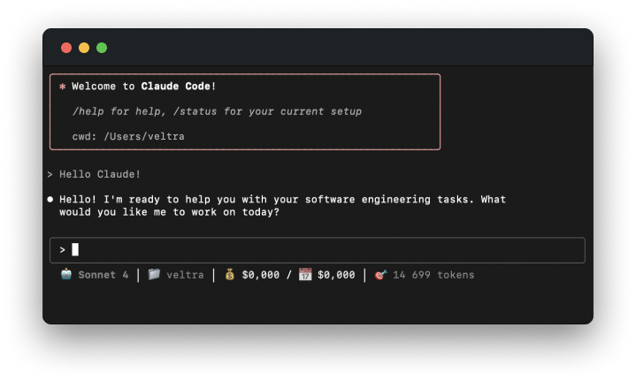

# Claude Code Enhanced Statusline

A customized statusline for Claude Code that provides comprehensive information about your development session, including costs, git status, and token usage.



## Features

### What the Statusline Shows

The statusline displays the following information from left to right:

1. **🤖 Model Name** (blue, bold) - Currently active Claude model
2. **🌿 Git Branch** with diff statistics
   - Branch name in light grey (clean) or light orange (uncommitted changes)
   - Shows lines added/removed from last commit: `(+12 -5)`
   - Only appears when in a git repository
3. **💰 Session Cost** (dark green) - Cost for current session
4. **📅 Daily Cost** (dark purple) - Total cost for today across all sessions
5. **🎯 Token Usage** (medium grey) - Total tokens used in current session

### Example Output
```
🤖 Default │ 🌿 main* (+12 -5) │ 💰 $1.234 / 📅 $5.678 │ 🎯 15,432 tokens
```

## Prerequisites

### Required Software
- **Claude Code** version 1.0.72 or higher
- **ccusage** - CLI tool for analyzing Claude Code usage
- **jq** - Command-line JSON processor
- **bc** - Basic calculator (for math operations)

### Installing ccusage

Install ccusage globally using npm:

```bash
npm install -g ccusage
```

Verify installation:
```bash
ccusage --version
```

### Installing jq

**macOS:**
```bash
brew install jq
```

**Linux (Ubuntu/Debian):**
```bash
sudo apt-get install jq
```

**Linux (CentOS/RHEL):**
```bash
sudo yum install jq
```

## Installation

1. **Create the statusline script:**

   Save the statusline script to `~/.claude/statusline.sh` and make it executable:

   ```bash
   chmod +x ~/.claude/statusline.sh
   ```

2. **Configure Claude Code settings:**

   Add the following to your `~/.claude/settings.json`:

   ```json
   {
     "statusLine": {
       "type": "command",
       "command": "bash ~/.claude/statusline.sh"
     }
   }
   ```

   If your settings.json file includes permissions or other settings, you can configure the status line as follows:

   ```json
   {
     "permissions": {
       "allow": [
         "Bash(npm:*)"
       ],
       "deny": []
     },
     "statusLine": {
       "type": "command",
       "command": "bash ~/.claude/statusline.sh"
     }
   }
   ```

3. **Restart Claude Code** for the changes to take effect.

## How It Works

### Cost Tracking
The statusline uses `ccusage` to provide accurate cost information:
- **Session Cost**: Retrieved from the most recent session in ccusage data
- **Daily Cost**: Aggregated from all sessions for the current day
- **Real-time Updates**: Costs update automatically as you use Claude Code

### Git Integration
Git information is gathered using standard git commands:
- Branch name and status (clean vs. uncommitted changes)
- Line diff statistics from the last commit
- Color coding: light grey for clean branches, light orange for dirty branches

### Token Counting
Token usage is tracked through ccusage, providing accurate counts of:
- Input tokens
- Output tokens  
- Cache tokens
- Total session tokens (displayed in statusline)

### Performance
The statusline is optimized for speed:
- ccusage provides fast access to usage data
- Minimal git command execution
- Efficient color coding and formatting

## Color Scheme

| Element | Color | Purpose |
|---------|--------|---------|
| Model Name | Bright Blue (#479AFF) | Easy identification |
| Clean Git Branch | Light Grey | Normal status |
| Dirty Git Branch | Light Orange | Attention needed |
| Added Lines | Yellow | Positive changes |
| Removed Lines | Red | Deletions |
| Session Cost | Dark Green | Current session |
| Daily Cost | Dark Purple | Day total |
| Token Count | Medium Grey | Usage metrics |

## Troubleshooting

### Common Issues

**Statusline not appearing:**
- Verify Claude Code version is 1.0.72 or higher
- Check that the statusline script is executable: `chmod +x ~/.claude/statusline.sh`
- Ensure settings.json syntax is correct

**Cost showing as $0.000:**
- Make sure ccusage is installed and accessible: `which ccusage`
- Verify ccusage can read Claude Code logs: `ccusage session --json`
- Check that you have Claude Code usage history

**Git information not showing:**
- Ensure you're in a git repository: `git status`
- Check that git commands work: `git branch --show-current`

**Token count not appearing:**
- Verify ccusage is providing token data: `ccusage session --json | jq '.sessions[0].totalTokens'`
- Ensure you have recent Claude Code activity

### Debug Mode

To debug the statusline, you can run it manually:

```bash
echo '{"model":{"display_name":"Test"},"workspace":{"current_dir":"'$(pwd)'"}}' | bash ~/.claude/statusline.sh
```

This will show you exactly what the statusline outputs and any error messages.

## Customization

The statusline is highly customizable. You can modify:

- **Colors**: Edit the ANSI color codes in the script
- **Emojis**: Change the emoji symbols used
- **Information displayed**: Add or remove components
- **Formatting**: Adjust separators and spacing

To customize, edit the `~/.claude/statusline.sh` file and restart Claude Code.

## Contributing

This statusline configuration leverages the power of ccusage for accurate usage tracking. For issues with ccusage itself, visit: https://github.com/ryoppippi/ccusage